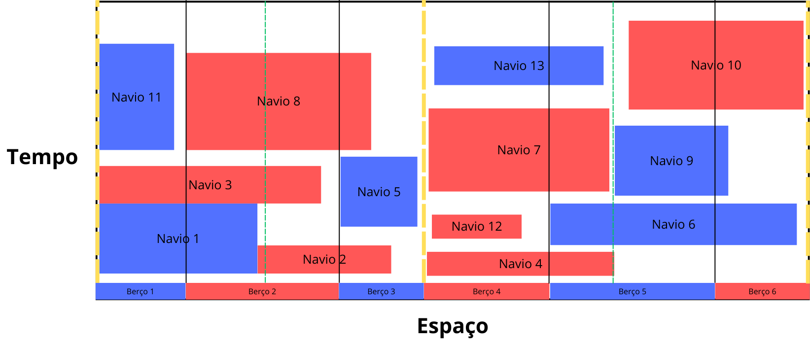
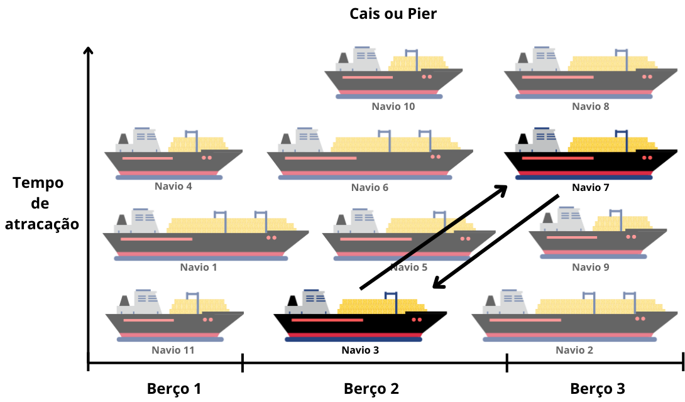
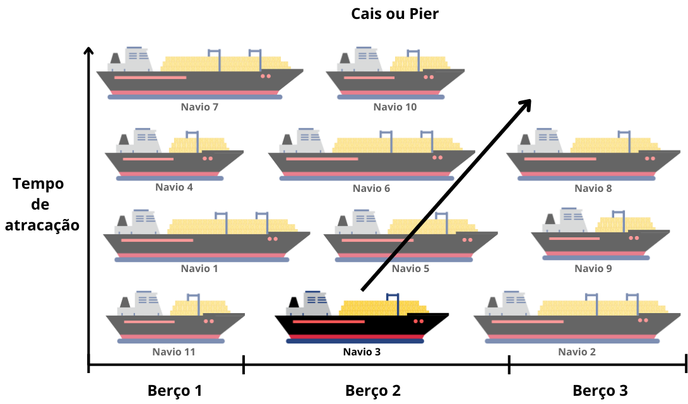
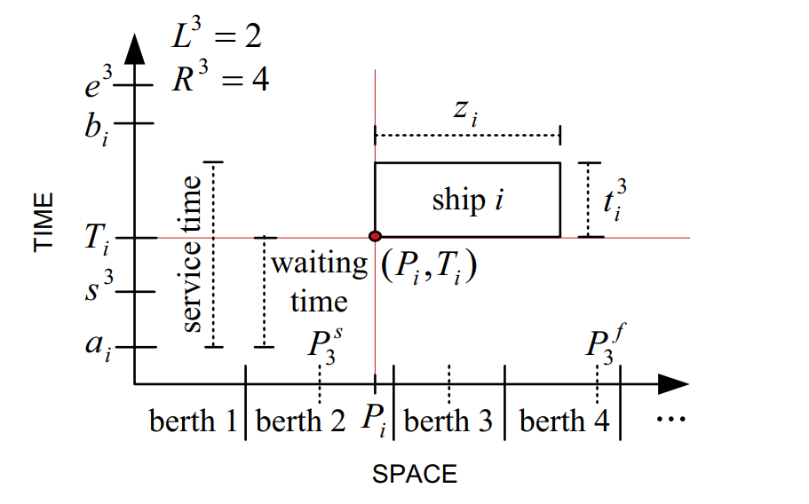

# :anchor: Algoritmo Híbrido GRASP+VNS para PAB-CH

## :page_facing_up: Descrição
Este repositório contém o Trabalho de Conclusão de Curso II (TCC 2) de Matheus Knack da Silva, que propõe uma abordagem híbrida GRASP+VNS para o Problema de Alocação de Berços Contínuos (PAB-CH). O foco é minimizar o tempo total de serviço dos navios em terminais portuários por meio de meta-heurísticas.

---

## :clipboard: Sumário
1. [Introdução](#introdução)
2. [Tipos de Abordagem](#tipos-de-abordagem)
3. [Revisão de Literatura](#revisão-de-literatura)
4. [Metodologia](#metodologia)
   - [GRASP](#grasp)
   - [VNS](#vns)
   - [Híbrido (GRASP+VNS)](#híbrido-graspvns)
5. [Geração de Vizinhança](#geração-de-vizinhança)
6. [Modelagem Matemática](#modelagem-matemática)
7. [Resultados](#resultados)
8. [Conclusões](#conclusões)
9. [Referências](#referências)
10. [Imagens](#imagens)

---

## :rocket: Introdução
O Problema de Alocação de Berços Contínuos (PAB-CH) é um desafio NP-difícil em otimização portuária, onde o objetivo é reduzir o tempo de espera e atendimento dos navios. Este trabalho apresenta um algoritmo híbrido que combina GRASP e VNS, explorando estruturas de vizinhança e diversificação para gerar soluções de alta qualidade em tempo computacional reduzido.

---

## :bulb: Tipos de Abordagem
- **Modelo Discreto**: Representação dos berços como segmentos discretos com posições fixas.
- **Modelo Contínuo**: Berços representados em um espaço contínuo, permitindo deslocamentos mais flexíveis.
- **Modelo Híbrido**: Combina discretização para redução de complexidade e flexibilidade contínua para ajustes finos.

---

## :books: Revisão de Literatura
- **PAB**: Modelos discreto, contínuo e híbrido; representação bidimensional como retângulos (Figura 2).  
  
- **GRASP** (Greedy Randomized Adaptive Search Procedure): fases de construção e busca local.  
- **VNS** (Variable Neighborhood Search): movimentos de troca, remoção/realocação e perturbação.

---

## :gear: Metodologia

### 1. GRASP
- Construção iterativa de soluções iniciais usando LC e LRC (α = 0,2).  
- Critério de seleção aleatório para berços prioritários.

### 2. VNS
- **Troca de Navios**: swap entre dois berços consecutivos.  
- **Remove e Realoca Navio**: realoca navio em berço disponível.  
- **Perturbação**: múltiplas trocas para diversificação (η = |K|).

### 3. Híbrido (GRASP+VNS)
- Integra fases de construção do GRASP com busca local do VNS.
- Parâmetros: α = 0,2, β = 50 → q = 39 000 iterações; limite de tempo = 120 s.

---

## :crown: Geração de Vizinhança
### Fluxo de Geração
1. Seleção da vizinhança (swap, reinserção, 2-opt).  
2. Aplicação de movimento para gerar novas soluções vizinhas.  
3. Avaliação e aceitação baseado em melhoria.

---

## :bar_chart: Modelagem Matemática
**Função Objetivo:**

Minimizar 
$$
 f(s) = \sum_{i\in N} \bigl(T^k_i - a_i + t^k_i\bigr)
$$

**Restrições:**
1. Cada navio atendido exatamente uma vez.  
2. Janela temporal de atracação e liberação do berço.  
3. Ausência de sobreposições entre navios.  

---

## :chart_with_upwards_trend: Resultados
- 30 instâncias com 60 navios e 13 berços.  
- Média f_best = 1 491,87; tempo médio ~64,4 s.  
- Comparação com ALNS e CS em termos de qualidade e eficiência.

| Método        | f_best–avg | ω_avg (s) | Δ_avg (%) |
|---------------|------------|-----------|-----------|
| ALNS          | 1 414,27   | 73,03     | 0,82      |
| CS            | 1 412,13   | 73,89     | 1,17      |
| **GRASP+VNS** | **1 491,87** | **64,43**  | **1,43**  |

---

## :checkered_flag: Conclusões
A abordagem GRASP+VNS demonstrou-se viável e eficiente, atingindo soluções próximas às melhores da literatura em menor tempo computacional. Trabalhos futuros podem explorar variantes de vizinhança e ajustes finos de parâmetros.

---

## :books: Referências
- Feo, T. A.; Resende, M. G. (1995). *Greedy randomized adaptive search procedures*.  
- Mauri, G. R. et al. (2016). *Adaptive Large Neighborhood Search for the PAB*.  
- Cordeau, J. F. et al. (2005). *Models and tabu search heuristics for berth allocation*.  

---

## :camera: Imagens
As figuras acima são referências para inclusão futura em alta qualidade. Substitua os arquivos em `images/` conforme necessário.
